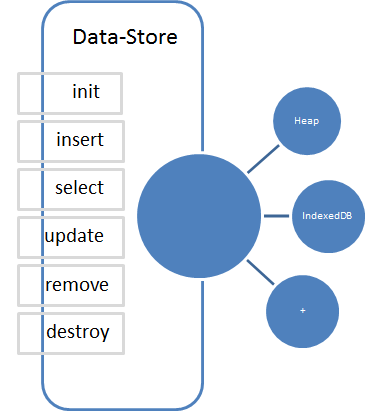

###[Sample App - ClientDataStore-Usage](https://github.com/csvignesh/ClientDataStore-Usage)

##Datastore implementation



* DataStore is no sql with indexes. The implementation depends on the browser capability. If there is indexedDB support, it uses idb. Else it falls back to heap.

* Every datastore instance will implement all the interface that the data-store exposes

* Currently we have only indexedDB and heap impl. We can extend it websql or which ever local storage it can use/ a completly service based impl. 

* Promise based implementation. Every interface should return a promise

##Assume we need marks of all students in a class
Each student has
* roll number (unique index)
* subject1 mark
* subject2 mark
* subject3 mark
* total

>Create DB and insert student data
>
>var dataStore = require('

##Interfaces
####init(dbName, metas)
Creates objectStores and indexes.
>dbName - name of the database you want to create.
>
>metas - Array that accepts list of ObjectStore(like table) and their indexes.
>
>output - promise
>
>promise resolution: empty

   ```json
    {
        name: "marksheet_jan",
        meta: [
				{name:'roll_numb', unique:true}
			]
    }
   ```

####insert(meta, data)
insert object(s) to the specified ObjectStore.

>meta - Object with ObjectStore name
>
>output - promise
>
>promise resolution: empty

Sample

meta:

   ```json
    {
        name: 'fits'
    }
   ```

data:

   ```json
    [{
        filter1: 'Jaguar',
		filter2: 'F-PACE',
		filter3: '2015',
		grpFil12: 'Jaguar|F-PACE',
		grpFil123: 'Jaguar|F-PACE|2015',
		select_count: 5
    }]
   ```
 
####select(meta, [filters])
Returns object(s) from the specified ObjectStore, based on the filter(s).

>meta - Object with ObjectStore name and index name which will be used if its a non filter selectAll case
>
>filters - {index, [filterData]}
> 
>output - promise
>
>promise resolution: Array of objects matching the filters

Sample

meta:

   ```json
    {
        name: 'fits', index
    }
   ```

filterData:

   ```json
    {
		index: grpFilter123,
        data: [
				'Jaguar|F-PACE|2015'
			]
    }
   ```

####update(meta, filterData, data)
Updates object(s) in the specified ObjectStore, based on the filter(s) and provided data. If any property is set to undefined, those properties will be dropped when updating.

>meta - Object with ObjectStore name
>
>filter - {index, [filterData]}
>
>data - {}
> 
>output - promise
>
>promise resolution: empty


Sample

meta:

   ```json
    {
        name: 'fits', index
    }
   ```

filterData:

   ```json
    {
		index: grpFilter123,
        data: [
				'Jaguar|F-PACE|2015'
			]
    }
   ```

data:

   ```json
    {
        filter1: 'Jaguar',
		filter2: 'F-PACE',
		filter3: '2015',
		grpFil12: 'Jaguar|F-PACE',
		grpFil123: 'Jaguar|F-PACE|2015',
		select_count: undefined
    }
   ```


####delete(meta, filterData)
Delete object(s) in the specified ObjectStore, based on the filter(s). Not providing any filter will delete all entries.

>meta - Object with ObjectStore name
>
>filter - {index, [filterData]}
> 
>output - promise
>
>promise resolution: empty

Sample

meta:

   ```json
    {
        name: 'fits', index
    }
   ```

filterData:

   ```json
    {
		index: grpFilter123,
        data: [
				'Jaguar|F-PACE|2015'
			]
    }
   ```

####destory(dbName)
>
>dbName - name of the database you want to create.
>

Clears and cleans up created datastore. 